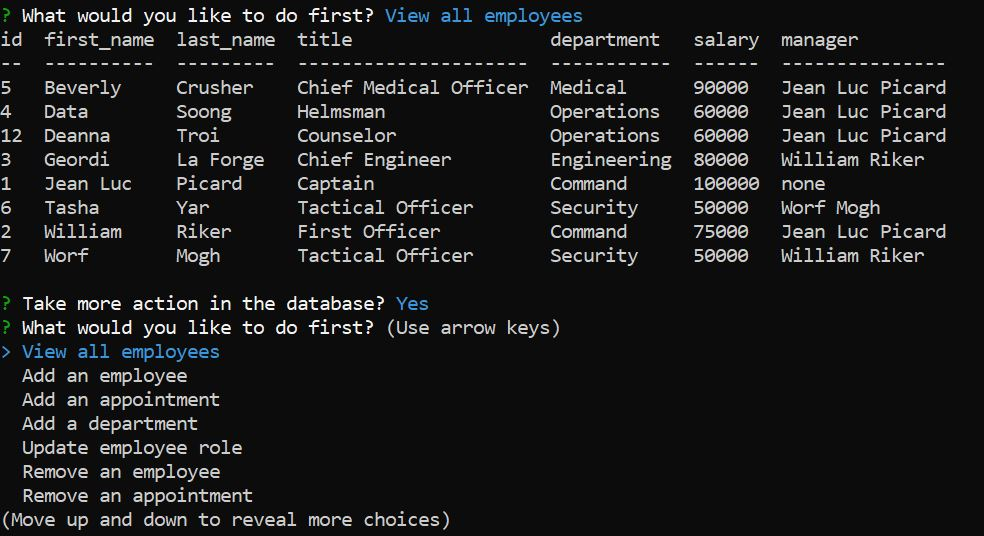

# fulcrum-employee-tracker-cms-homework12
This is a Git Hub repository for the NU Coding Bootcamp Employee Tracker CMS Homework for Week 12.




# Setup

Once logged in with [GitHub account](https://github.login/), clone the repo locally using link:

```sh
  git clone https://github.com/gideonrynn/teampacr-profile-generator-hw7.git
```

Update password and database to local database. Example files in test files folder. 

Also see: [Cloning a repository](https://help.github.com/en/github/creating-cloning-and-archiving-repositories/cloning-a-repository).


# Usage

Fulcrum is a CMS that allows users to track department and employee business data. With information in the CMS, business managers can easily retrieve an overview of the department, report on the number of employees, salaries, and roles, and make informed business decisions for fiscal year goals.

Application is initiated in the command line. 


# Technologies

This project was built using:

  - Node
  - [console.table 0.10.0](https://www.npmjs.com/package/console.table)
  - [InquirerJs ^7.0.3](https://www.npmjs.com/package/inquirer/v/0.2.3) - installed from 0.2.3, listed ^7
  - [MySQL 2.17.1](https://www.npmjs.com/package/mysql)
  


# License

This project uses the MIT License. See the full details here: https://choosealicense.com/licenses/mit/ 
